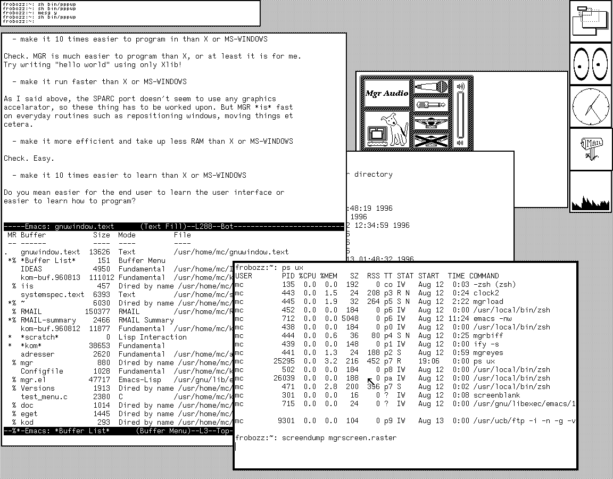

# The MGR Window System



This is a windowing system from the 1980s that was developed at Bellcore.

Further Reading:

- [https://hack.org/~mc/mgr/](https://hack.org/~mc/mgr/)
- [https://en.wikipedia.org/wiki/ManaGeR](https://en.wikipedia.org/wiki/ManaGeR)
- [https://sau.homeip.net/](https://sau.homeip.net/)

## License

Additional credits for this fork:

- [Stephen A. Uhler](https://sau.homeip.net/) (original author of MGR)
- [Michael Cardell Widerkrantz](https://hack.org/~mc/mgr/) (for providing MGR 0.69 source code)
- [Nina Kalinina](https://tech.lgbt/@nina_kali_nina/115340373015475265) (for inspiring this fork)
- [Bruce Mitchener](https://github.com/ProgrammerArchaeology/bellcore-mgr) (for CMake port)
- [Howard Chu](https://github.com/hyc/mgr/) (for X11 port)
- [alex-arknetworx](https://github.com/alex-arknetworx/mgr) (for build instructions that worked)

```
                        Copyright (c) 1988 Bellcore
                            All Rights Reserved
       Permission is granted to copy or use this program, EXCEPT that it
       may not be sold for profit, the copyright notice must be reproduced
       on copies, and credit should be given to Bellcore where it is due.
       BELLCORE MAKES NO WARRANTY AND ACCEPTS NO LIABILITY FOR THIS PROGRAM.

This applies to the MGR server, some of the device drivers,
the include files, the programmer's manual, and many of the clients
and their manuals.  Other copyrights may apply to individual
clients or packages, if so marked.
Bitmap fonts cannot be copyrighted in the USA.
The icons supplied with MGR might be copyrightable, who knows?
```
